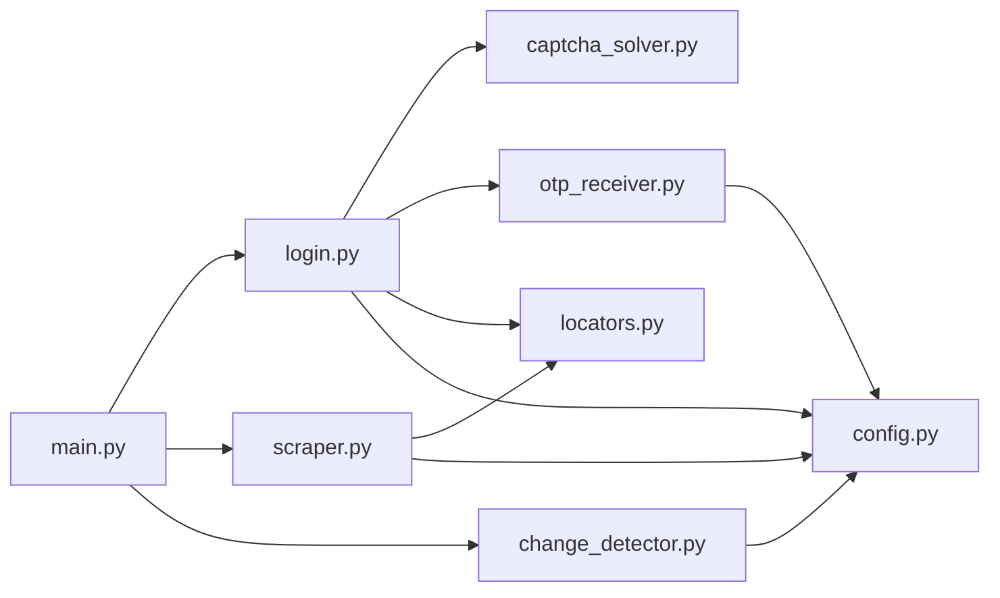

# IREPS Tender Scraper

Automated Python scraper for the [IREPS (Indian Railway E-Procurement System)](https://www.ireps.gov.in) tender portal. Handles CAPTCHA solving, SMS OTP automation, two-phase tender data extraction, and change tracking — all persisted to a local JSON memory file.

---

## Features

| Feature | Details |
|---------|---------|
| **Automated Login** | CAPTCHA solved via 2captcha API, OTP received via SMS Forwarder webhook |
| **OTP Caching** | Reuses the same OTP for 24 hours (IREPS allows daily reuse) — avoids burning the 2-per-hour generation limit |
| **Session Persistence** | Saves browser session to disk; reuses for up to 20 hours before re-login |
| **Two-Phase Scraping** | Phase 1: listing table (tender no, title, status, due date) → Phase 2: detail pages (documents, financial fields) |
| **Document Extraction** | Downloads tender PDF URL + all attached documents from the `#attach_docs` table on each detail page |
| **Change Detection** | Classifies tenders as NEW / UPDATED / STATUS_CHANGED / UNCHANGED across runs |
| **Atomic Data Persistence** | JSON writes use temp-file + rename pattern to prevent corruption; `.bak` backup before every write |
| **Health Monitoring** | Optional webhook fires on scrape success or failure (Slack, Discord, custom) |
| **Headless Production Mode** | Runs without a visible browser; `input()` prompts are auto-skipped in headless |
| **External Scheduling** | Designed for cron, AWS EventBridge, GCP Cloud Scheduler — no built-in scheduler |

---

## Quick Start

### 1. Prerequisites

- **Python 3.10+**
- A [2captcha](https://2captcha.com/) account with API key and balance
- An Android phone with [SMS Forwarder](https://play.google.com/store/apps/details?id=com.frfrfr.smsforwarder) installed
- A registered IREPS mobile number
- [ngrok](https://ngrok.com/) (optional, for forwarding SMS webhooks from phone to local machine)

### 2. Install Dependencies

```bash
cd ireps_scraper
pip install -r requirements.txt
playwright install chromium
```

**Dependencies:**
| Package | Purpose |
|---------|---------|
| `playwright` | Browser automation (Chromium) |
| `2captcha-python` | CAPTCHA solving API client |
| `flask` | OTP webhook server |
| `python-dotenv` | `.env` file loader |
| `requests` | HTTP requests (health webhook) |

### 3. Configure Environment

```bash
# Copy the example config and fill in your real values
cp .env.example .env
```

Edit `.env` with your actual credentials. See [`.env.example`](.env.example) for all available variables and their descriptions.

> **⚠️ Never commit `.env` — it contains secrets. It's already in `.gitignore`.**

### 4. Configure SMS Forwarder (Android)

This app forwards IREPS OTP SMSes to the scraper's webhook:

1. Install **SMS Forwarder** from Play Store
2. Open app → **Add Rule**
3. **Trigger:** SMS received containing `IREPS` or `OTP`
4. **Action:** HTTP POST to `http://YOUR_SERVER_IP:5050/sms-webhook`
5. **Request body** (JSON):
   ```json
   {
     "from": "%from%",
     "message": "%message%",
     "timestamp": "%timestamp%"
   }
   ```
6. **Content-Type:** `application/json`
7. Ensure phone and server are on the **same network**, or use ngrok:
   ```bash
   ngrok http 5050
   ```
   Then set the SMS Forwarder URL to `https://YOUR_NGROK_URL/sms-webhook`

### 5. Test Components

```bash
# Test OTP webhook round-trip (starts local server, sends mock SMS)
python test_otp_webhook.py

# Test 2captcha integration (requires API key with balance)
python test_captcha.py

# Test full login flow in visible browser
python main.py --test-login
```

### 6. Run

```bash
# Run a single scrape (headless)
python main.py --run-now
```

---

## Project Structure

```
ireps_scraper/
├── main.py               # Entry point — CLI, scrape orchestration, health webhook
├── login.py              # Login automation (CAPTCHA + OTP + session management)
├── scraper.py            # Two-phase tender scraping (listing + detail pages)
├── captcha_solver.py     # 2captcha API integration with retry logic
├── otp_receiver.py       # Flask webhook server for SMS OTP reception
├── change_detector.py    # JSON memory management + diff detection
├── config.py             # Environment config loader (all settings from .env)
├── locators.py           # Centralized Playwright locator definitions
├── cleanup_memory.py     # Utility: clean junk values from tenders_memory.json
├── verify_memory.py      # Utility: inspect tenders_memory.json contents
├── inspect_selectors.py  # Dev tool: inspect page selectors
├── inspect_action_col.py # Dev tool: inspect Actions column HTML
├── inspect_action_html.py# Dev tool: inspect action icon attributes
├── inspect_detail_page.py# Dev tool: inspect tender detail page structure
├── test_otp_webhook.py   # Test: OTP webhook round-trip
├── test_captcha.py       # Test: 2captcha API
├── .env.example          # Template config (copy to .env)
├── .env                  # Credentials & config (never commit!)
├── requirements.txt      # Python dependencies
├── session/              # Saved Playwright browser sessions
│   └── ireps_session.json
├── data/                 # Persistent data
│   ├── tenders_memory.json       # All scraped tenders (primary data store)
│   ├── tenders_memory.json.bak   # Auto-backup before each write
│   └── otp_cache.json            # Cached OTP for 24-hour reuse
└── logs/                 # Rotating log files (7-day retention)
    └── scraper.log
```

---

## Execution Pipeline

Each `--run-now` execution follows this pipeline:

```
┌─────────────────────────────────────────────────────────┐
│  Step 1: ensure_session()                               │
│  ├─ Check saved session file (< 20 hrs old)             │
│  ├─ If valid → load cookies + verify by navigating      │
│  └─ If expired/invalid → full login flow:               │
│     ├─ Navigate to login page                           │
│     ├─ Fill mobile number                               │
│     ├─ Solve CAPTCHA (via 2captcha API)                 │
│     ├─ Click "Get OTP" → use cached OTP if < 24h old   │
│     ├─ If cached fails → wait for webhook OTP           │
│     ├─ Fill OTP + Proceed                               │
│     └─ Save session + cache OTP                         │
├─────────────────────────────────────────────────────────┤
│  Step 2: scrape_tenders()                               │
│  ├─ Phase 1 — Listing Table                             │
│  │  ├─ Navigate to "All Active Tenders" tab             │
│  │  ├─ Iterate all pagination pages                     │
│  │  ├─ Extract: tender_no, title, status, due_date      │
│  │  └─ Filter: only "Works" work area                   │
│  ├─ Phase 2 — Detail Pages                              │
│  │  ├─ Click "View Tender Details" icon per tender      │
│  │  ├─ Extract: closing_date, estimated_value, etc.     │
│  │  ├─ Capture tender PDF download URL                  │
│  │  ├─ Extract attached documents from #attach_docs     │
│  │  └─ Retry up to 3 times on failure                   │
│  └─ 2-4s random delay between pages (anti-detection)    │
├─────────────────────────────────────────────────────────┤
│  Step 3: detect_changes()                               │
│  ├─ Compare scraped tenders vs tenders_memory.json      │
│  └─ Classify: NEW / UPDATED / STATUS_CHANGED / UNCHANGED│
├─────────────────────────────────────────────────────────┤
│  Step 4: update_memory()                                │
│  ├─ Merge new data into memory (union-based doc merge)  │
│  ├─ Atomic write: .tmp → .bak → rename                  │
│  └─ Send health webhook (if configured)                 │
└─────────────────────────────────────────────────────────┘
```

---

## CLI Reference

| Command | Description |
|---------|-------------|
| `python main.py --run-now` | Run a single scrape cycle (headless by default) |
| `python main.py --test-login` | Test login in visible browser (always headed) |
| `python test_otp_webhook.py` | Test OTP webhook round-trip with mock SMS |
| `python test_captcha.py [image]` | Test 2captcha API (optional real CAPTCHA image) |
| `python cleanup_memory.py` | Remove junk values from tenders_memory.json |
| `python verify_memory.py` | Quick inspect of tenders_memory.json contents |

---

## Change Detection

The scraper maintains a JSON memory file (`data/tenders_memory.json`). On each run it compares newly scraped data against the stored memory:

| Classification | Meaning | Log Level |
|---|---|---|
| **NEW** | Tender number not seen before | DEBUG |
| **UPDATED** | Any field value changed (except status) | INFO |
| **STATUS_CHANGED** | Status changed (e.g. Published → Closed) | INFO (critical) |
| **UNCHANGED** | Identical to last run | — |

Data is keyed by `tender_no` — **duplicates are impossible by design**. Updates merge into the existing record:
- **Documents:** Union-merge by `file_url` — previously captured docs are never lost even if Phase 2 fails
- **Tender PDF URL:** Preserved from old record if new scrape returns empty
- **Timestamps:** `_last_seen` updated on every successful scrape

---

## Data Storage Format

Each tender in `tenders_memory.json`:

```json
{
  "tender_no": "ELS-CNB-2025-26-ET-14",
  "deptt_rly_unit": "CENTRAL RAILWAY/ELECTRICAL",
  "tender_title": "Supply of cable and accessories",
  "status": "Published",
  "work_area": "Works",
  "due_date_time": "10/03/2026 15:00",
  "tender_type": "Open Tender",
  "closing_date": "10/03/2026 15:00",
  "tender_doc_download_url": "https://www.ireps.gov.in/ireps/works/pdfdocs/...",
  "attached_documents": [
    {
      "file_name": "TenderDocument.pdf",
      "file_url": "https://www.ireps.gov.in/ireps/upload/files/...",
      "description": "Main tender document"
    }
  ],
  "_last_seen": "2026-02-24T14:36:22.123456"
}
```

---

## Environment Variables

| Variable | Required | Default | Description |
|----------|----------|---------|-------------|
| `IREPS_MOBILE` | ✅ | — | Registered IREPS mobile number |
| `TWOCAPTCHA_API_KEY` | ✅ | — | 2captcha API key |
| `FLASK_PORT` | ❌ | `5050` | Port for OTP webhook server |
| `FLASK_SECRET` | ❌ | `change-me` | Flask secret key |
| `HEADLESS` | ❌ | `true` | `true` for production, `false` for debugging |
| `SESSION_FILE` | ❌ | `session/ireps_session.json` | Path to saved browser session |
| `DATA_DIR` | ❌ | `data/` | Directory for JSON data files |
| `LOG_FILE` | ❌ | `logs/scraper.log` | Path to log file |
| `HEALTH_WEBHOOK_URL` | ❌ | — | URL for health monitoring webhooks (Slack, Discord, etc.) |

---

## Scheduling (Production)

The scraper has no built-in scheduler. Use external tools:

**Linux/Mac (cron):**
```bash
# Run 3 times daily at 6 AM, 1 PM, 7 PM IST
0 6,13,19 * * * cd /path/to/ireps_scraper && python main.py --run-now >> /dev/null 2>&1
```

**Windows (Task Scheduler):**
```
Program: python
Arguments: main.py --run-now
Start in: C:\path\to\ireps_scraper
```

**Cloud (AWS/GCP):**
- AWS: EventBridge + Lambda/ECS task
- GCP: Cloud Scheduler + Cloud Run

---

## Health Monitoring

Set `HEALTH_WEBHOOK_URL` in `.env` to receive alerts. The scraper sends a POST with:

```json
{
  "status": "success",
  "message": "Scrape completed in 107s — 10 tenders (3 new, 1 updated, 0 status changed)",
  "timestamp": "2026-02-24T14:36:22.123456",
  "source": "ireps_scraper"
}
```

On failure:
```json
{
  "status": "failure",
  "message": "Scrape run FAILED: Login failed — CAPTCHA incorrect on all 2 attempts",
  "timestamp": "2026-02-24T14:36:22.123456",
  "source": "ireps_scraper"
}
```

Works with Slack incoming webhooks, Discord webhooks, or any custom endpoint that accepts JSON POST.

---

## Troubleshooting

| Issue | Fix |
|---|---|
| CAPTCHA solve fails | Check 2captcha balance; verify CAPTCHA image loads; check `captcha_solver.py` logs |
| OTP not received | Verify SMS Forwarder is configured; check phone network; check `/health` endpoint on the webhook server |
| Session expired mid-run | Scraper auto-detects and re-logins; check logs for 'Session verification failed' |
| `playwright install` fails | Run as admin: `playwright install chromium --with-deps` |
| Rate limited by IREPS | Increase `MIN_DELAY`/`MAX_DELAY` in `config.py` (default: 2-4 seconds) |
| JSON data lost between runs | Fixed with atomic writes — check for `.bak` file as recovery; file was previously corrupted by process crash during write |
| OTP generation quota exceeded | IREPS allows only 2 OTP generations per hour; the scraper limits to 2 attempts per run |
| Detail fields empty | Some fields (estimated_value, emd_amount) may not exist on all tender types; check logs for extraction debug messages |
| `input()` hangs in production | Fixed — `input()` is skipped in headless mode; ensure `HEADLESS=true` in `.env` |

---

## Important Notes

- **Single IP** — Do NOT use rotating proxies. IREPS pins the session to your IP address.
- **OTP valid 24 hours** — IREPS sends the same OTP for a full day. The scraper caches it in `data/otp_cache.json` and reuses it across runs.
- **Rate limiting** — 2–4 second random delay between page loads. Do not reduce below 2 seconds.
- **Credentials** — Keep `.env` out of version control. It's already in `.gitignore`.
- **Playwright locators** — Uses text-based locators (`get_by_text`, `get_by_placeholder`, `get_by_role`) instead of CSS selectors for resilience. If IREPS changes UI text, update `locators.py`.
- **MAX_TENDERS_DEV** — Set to `0` in `config.py` for unlimited (production). Set to a positive integer (e.g. `10`) for development/testing.
- **Data safety** — The JSON memory uses atomic writes (write to `.tmp` → backup to `.bak` → rename). If `tenders_memory.json` is ever corrupted, restore from `.bak`.

---

## For Developers

### Quick Setup

```bash
git clone <repo-url>
cd ireps_scraper
pip install -r requirements.txt
playwright install chromium
cp .env.example .env
# Edit .env with real credentials
python main.py --test-login   # Test login in visible browser
python main.py --run-now       # Full scrape
```

### Architecture Overview



### Key Design Decisions

| Decision | Rationale |
|----------|-----------|
| Text-based Playwright locators | More resilient than CSS selectors when IREPS changes IDs/classes |
| OTP cached for 24 hours | IREPS reuses the same OTP value for a full day |
| Max 2 login attempts per run | IREPS limits OTP generation to 2 per hour |
| Atomic JSON writes | Prevents data corruption from crashes mid-write |
| No built-in scheduler | Keeps the scraper stateless; scheduling is environment-specific |

### Known Limitations

- **No incremental save** — If the scraper is stopped mid-run (Ctrl+C), data collected so far is lost. The JSON is saved only after all scraping completes.
- **Session pinned to IP** — Cannot use proxy rotation; IREPS ties sessions to the originating IP.
- **OTP requires phone pipeline** — Automated OTP reception depends on ngrok + SMS Forwarder running on an Android device.
- **IREPS table structure** — Some header/form rows in the listing table are parsed before being filtered. This produces `CLICK_FAILED` warnings in logs (cosmetic, not functional).
